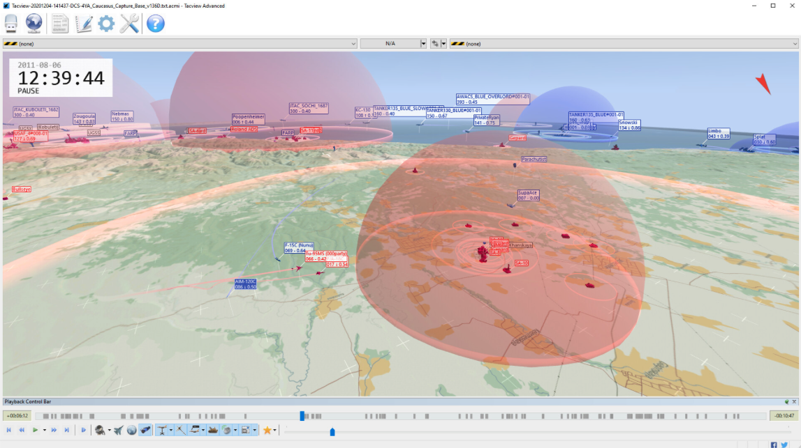
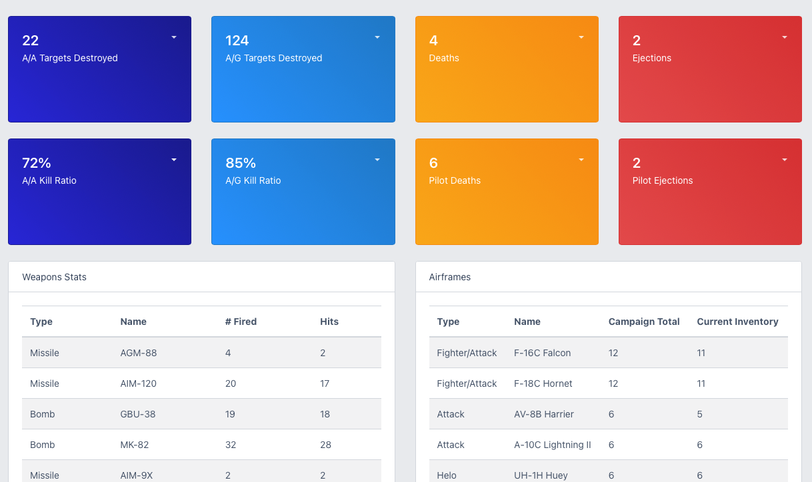

# tacview2db
A Python script that will process a TacView XML log file derived from a Digital Combat Simulator (DCS) mission. It processes this file to create a SQLite3 relational database of objects that can be used for analysis and queries.

# What is Digital Combat Simulator?
Digital Combat Simulator (DCS) is a flight simulation game that offer high fidelity modeling of several military aircraft. In addition, it models the combat systems of these aircraft and enables users to not only fly aircraft but use the weapons on the aircraft to achieve goals within a mission. The game ships with a mission editor to create scenarios for players and simulates dozens of aircraft from around the world.
[Digital Combat Simulator](https://www.digitalcombatsimulator.com)

# What is TacView?
Tacview is software that is able to record activity in a DCS mission using a Lua hook to extract live telemetry as it is being played. This enables TacView to visually represent missions so that players can debrief, examine tactics and learn lessons.


[A TacView file showing an air defence sites and various players in the air.](https://www.tacview.net/product/about/en/)

# Why **tacview2db**?
TacView provides an excellent way of visualising and capturing telemetry in chronological order. However, if you would like to keep track of statistics over time, or identify the effectiveness of weapons, it is best to have a relational database that would provide the ability to query this information.

**tacview2db** processes TacView data in the form of XML and stores it in an SQLite database to provide you with the ability to query a rich set of events. Using this data you can answer questions such as:

- What is the hit rate of weapon X?
- Which call sign has the most kills during over the course of a campaign?
- Which aircraft/player is most effective at Air to Air?
- How many ground targets were hit in a mission or campaign?

In short, it provides a rich relational database that can provide statistics over a period of time. This data could then further be visualised in a website dashboard or some other reporting tool.


> A sample dashboard built using Django that references a DB built with tacview2db.

## How to install

### Prerequisites
- Python 3.7 or newer
- Internet connection for downloading packages

### Installation Steps

#### 1. Clone the repository
```bash
git clone https://github.com/username/tacview2db.git
cd tacview2db
```

#### 2. Set up a Python virtual environment
A virtual environment keeps your project dependencies isolated.

**On Windows:**
```bash
python -m venv venv
venv\Scripts\activate
```

**On macOS/Linux:**
```bash
python3 -m venv venv
source venv/bin/activate
```

When successful, you'll see `(venv)` at the beginning of your command prompt.

#### 3. Install dependencies using pip
Once your virtual environment is activated:

**On Windows:**
```bash
pip install -r requirements.txt
```

**On macOS/Linux:**
```bash
pip3 install -r requirements.txt
```

#### 4. Verify installation
To verify everything is working properly:
```bash
python tacview2db.py --help
```

You should see the help information displayed as shown below.

### Troubleshooting

- **"Command not found" errors**: Make sure you've activated the virtual environment
- **Import errors**: Try reinstalling the requirements with `pip install -r requirements.txt --force-reinstall`
- **Permission issues**: On Linux/macOS, you might need to use `sudo` or adjust file permissions

## How To Use **tacview2db**
Tacview has the ability to export its native Tacview file format into XML. 
1. Use the File menu in Tacview to export a currently viewed Tacview file as XML. (the Tacview file should preferably be from the server and not a client in the recently flown mission)
2. Place the XML file in the same directory as ```tacview2db.py```. Or you can specify a path to the file when calling the command in the terminal.
3. Run the Python script passing it the name of your xml file. (eg. ```python tacview2db.py mymission.xml```)

Typing ```python tacview2db.py -h``` will give you some help.
```
usage: tacview2db.py [-h] filename

Process TacView XML into a SQLite3 database.

positional arguments:
  filename    the XML filename to process

optional arguments:
  -h, --help  show this help message and exit
  -c, --cleardb Clears the database of any existing data before importing the XML file.
  -v, --verbose Turn on verbose logging for the command line.
  ```

>Whilst **tacview2db** is essentially a command line tool it also has a GUI.
If you do not provide files as parameters to the ```tacview2db.py``` command it will launch with a GUI that will help you select files for import.

## How It Works
The TacView XML is basically a list of events. An event consists of an action and several objects. Each event will have an action and a Primary Object as a minimum. Depending on the type of action, the event may also contain a Secondary Object and a Parent Object.

<insert example of how the data hangs together here>

This Python script processes these events and builds out a relational data model in the pytacview.db SQLite database. The database contains the following tables:
- Mission (data pertaining to the mission you are importing)
- Events (the events contained in the XML). This is related to the Mission table.
- PrimaryObjects (a list of primary objects related to an event)
- SecondaryObjects (a list of secondary objects related to an event)
- ParentObjects (a list of parent objects related to an event)

The database also contains some sample views that will give you ideas for how to structure SQL queries to get some value out of the data.

